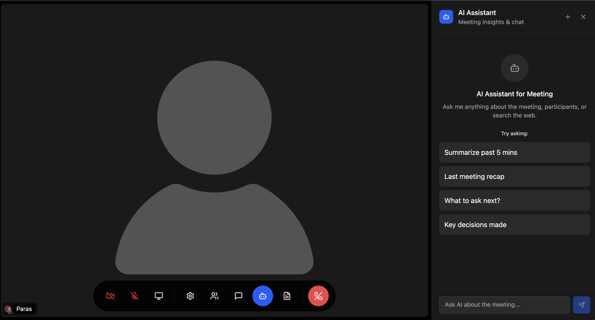
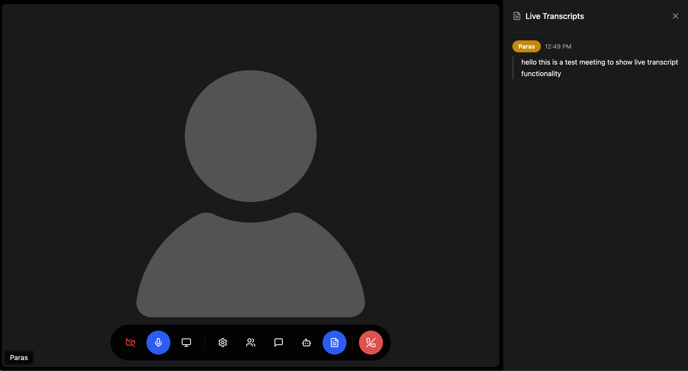
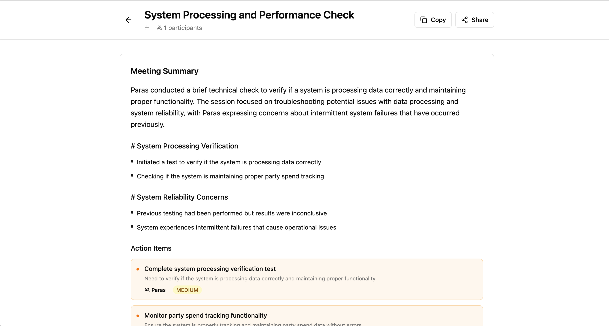
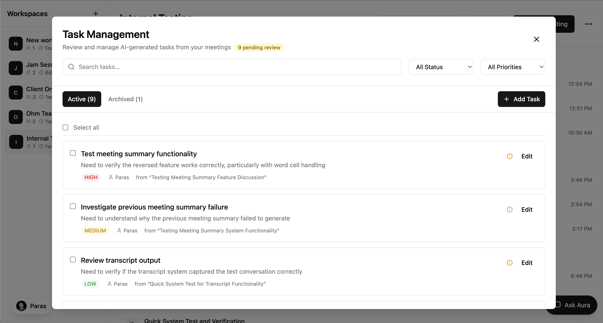
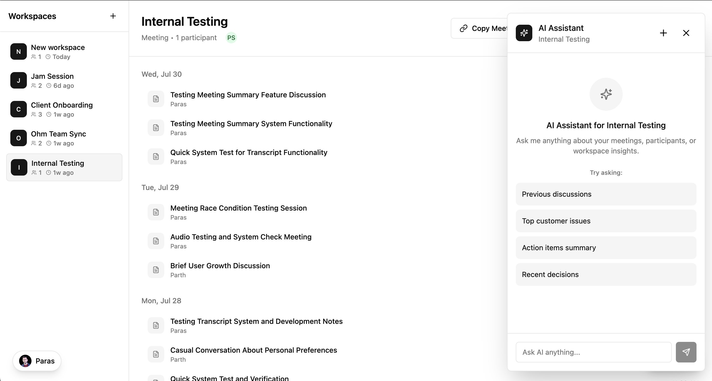

# Aura - AI-First Video Conferencing Platform

An enterprise-grade AI-native video conferencing platform built with Next.js 15, React 18, TypeScript, and LiveKit. Transform every meeting into a searchable, shareable, actionable workspace with advanced AI capabilities, real-time collaboration, and intelligent meeting management.

## 🌟 Key Features

### 🎥 **Advanced Video Conferencing**
- High-quality real-time video/audio with LiveKit
- Adaptive bitrate and network optimization
- Multi-participant support with grid/spotlight layouts
- Screen sharing and presentation mode

### 🤖 **AI-Powered Meeting Intelligence**
- **Claude AI Assistant**: Advanced conversational AI using Anthropic's Claude
- **Real-time Transcription**: Live speech-to-text during meetings
- **Contextual Understanding**: AI accesses current and historical meeting data
- **Vector Search**: Semantic search through meeting history using Pinecone
- **Meeting Summaries**: Automatic generation of key points and decisions
- **Action Item Extraction**: AI identifies and tracks tasks and assignments
- **Web Search Integration**: AI can search the web for real-time information

### 🏢 **Enterprise Meeting Management**
- **Persistent Meeting Workspaces**: Create and manage dedicated meeting spaces
- **User Authentication**: Secure access with Clerk authentication
- **Subscription Management**: Tiered access with Stripe integration
- **Meeting History**: Complete archive of past meetings and transcripts
- **Participant Management**: Role-based permissions (host/participant)
- **Email Invitations**: Automated meeting invites via Resend
- **Calendar Integration**: Schedule recurring meetings (coming soon)

### 💬 **Enhanced Collaboration**
- **Real-time Chat**: In-meeting messaging with participants
- **AI Chat Integration**: Chat directly with AI during meetings
- **Task Management**: Create and assign tasks within meetings

## 📱 Product Interface

<div align="center">

### Real-time AI Assistant


*Chat with AI during meetings for instant insights and answers*

### Live Transcription


*Automatic speech-to-text transcription during meetings*

### Meeting Summaries


*AI-generated meeting summaries with key points and decisions*

### Task Management


*Create and assign tasks directly from meeting discussions*

### Meeting Workspace


*Comprehensive meeting workspace with all tools integrated*

</div>

## 🛠 Tech Stack

### **Frontend & Core**
- **Next.js 15**: App Router with React Server Components
- **React 18**: Latest React features with Concurrent Rendering
- **TypeScript**: Full type safety and IntelliSense
- **Tailwind CSS**: Utility-first styling with custom design system
- **Framer Motion**: Smooth animations and transitions

### **Video & Real-time Communication**
- **LiveKit**: WebRTC infrastructure for video/audio
- **LiveKit Components**: Pre-built React components
- **Real-time Messaging**: WebSocket-based chat system

### **AI & Machine Learning**
- **Anthropic Claude**: Advanced conversational AI (Claude-3.5 Sonnet & Claude-4)
- **OpenAI**: Text embeddings for semantic search
- **Pinecone**: Vector database for AI context retrieval
- **Hybrid RAG**: Retrieval-Augmented Generation system

### **Backend & Database**
- **MongoDB**: Document database with Mongoose ODM
- **Zustand**: State management for complex UI state
- **Server Actions**: Next.js server-side data mutations

### **Authentication & Payments**
- **Clerk**: Complete authentication and user management
- **Stripe**: Subscription billing and payment processing
- **Webhook Handling**: Real-time event processing

### **Communication & Notifications**
- **Resend**: Transactional email service
- **React Hot Toast**: In-app notifications
- **Real-time Updates**: Live meeting status and notifications

### **Development & Deployment**
- **Vercel**: Serverless deployment platform
- **ESLint & Prettier**: Code quality and formatting
- **TypeScript**: Full type coverage
- **Turbo**: Fast development builds

## 🚀 Quick Start

### Prerequisites
- **Node.js 18+** (recommended: use Node.js 20)
- **MongoDB** (local installation or MongoDB Atlas)
- **Package Manager**: npm, yarn, or pnpm

### Installation

1. **Clone the repository:**
```bash
git clone <repository-url>
cd aura
```

2. **Install dependencies:**
```bash
npm install
# or
pnpm install
```

3. **Set up environment variables:**
```bash
cp env.example .env.local
```

4. **Configure your environment variables in `.env.local`:**

See the [Environment Variables](#-environment-variables) section below for detailed configuration.

5. **Start the development server:**
```bash
npm run dev
# or for faster builds with Turbo
npm run dev --turbo
```

6. **Open your browser:**
Navigate to [http://localhost:3000](http://localhost:3000) to access Aura.

### 🔧 Available Scripts

```bash
# Development
npm run dev              # Start development server
npm run dev --turbo      # Start with Turbo (faster builds)

# Production
npm run build            # Build for production
npm run start            # Start production server

# Code Quality
npm run lint             # Run ESLint
npm run lint:fix         # Fix ESLint issues
npm run format:check     # Check Prettier formatting
npm run format:write     # Apply Prettier formatting

# Database & AI
npm run migrate-pinecone # Migrate data to Pinecone
npm run test-pinecone    # Test Pinecone connection
npm run check-data       # Check existing data
```

## 🔐 Environment Variables

The application requires several API keys and configuration variables. Copy `env.example` to `.env.local` and fill in your values:

### **Core Services (Required)**

| Variable | Description | Where to Get |
|----------|-------------|--------------|
| `LIVEKIT_API_KEY` | LiveKit API key for video/audio | [LiveKit Console](https://cloud.livekit.io) |
| `LIVEKIT_API_SECRET` | LiveKit API secret | [LiveKit Console](https://cloud.livekit.io) |
| `LIVEKIT_URL` | LiveKit WebSocket URL | [LiveKit Console](https://cloud.livekit.io) |
| `MONGODB_URI` | MongoDB connection string | [MongoDB Atlas](https://cloud.mongodb.com) or local |

### **Authentication & Users**

| Variable | Description | Where to Get |
|----------|-------------|--------------|
| `NEXT_PUBLIC_CLERK_PUBLISHABLE_KEY` | Clerk public key | [Clerk Dashboard](https://dashboard.clerk.com) |
| `CLERK_SECRET_KEY` | Clerk secret key | [Clerk Dashboard](https://dashboard.clerk.com) |
| `CLERK_WEBHOOK_SECRET` | Clerk webhook secret | [Clerk Dashboard](https://dashboard.clerk.com) |

### **AI & Machine Learning**

| Variable | Description | Where to Get |
|----------|-------------|--------------|
| `ANTHROPIC_API_KEY` | Claude AI API key | [Anthropic Console](https://console.anthropic.com) |
| `OPENAI_API_KEY` | OpenAI API for embeddings | [OpenAI Platform](https://platform.openai.com) |
| `PINECONE_API_KEY` | Vector database API key | [Pinecone Console](https://www.pinecone.io) |

### **Communication & Payments**

| Variable | Description | Where to Get |
|----------|-------------|--------------|
| `RESEND_API_KEY` | Email service API key | [Resend Console](https://resend.com) |
| `STRIPE_SECRET_KEY` | Stripe payment processing | [Stripe Dashboard](https://dashboard.stripe.com) |
| `STRIPE_WEBHOOK_SECRET` | Stripe webhook secret | [Stripe Dashboard](https://dashboard.stripe.com) |
| `STRIPE_PRICE_ID` | Subscription price ID | [Stripe Dashboard](https://dashboard.stripe.com) |

### **App Configuration**

| Variable | Description | Default |
|----------|-------------|---------|
| `NEXT_PUBLIC_APP_URL` | Your app's base URL | `http://localhost:3000` |
| `NEXT_PUBLIC_SHOW_SETTINGS_MENU` | Show settings menu | `false` |

### 📋 Getting API Keys

<details>
<summary><strong>🎥 LiveKit Setup</strong></summary>

1. Sign up at [LiveKit Cloud](https://cloud.livekit.io)
2. Create a new project
3. Go to **Settings** → **Keys**
4. Copy the **API Key**, **API Secret**, and **WebSocket URL**
5. Your WebSocket URL format: `wss://your-project.livekit.cloud`

</details>

<details>
<summary><strong>🔐 Clerk Authentication Setup</strong></summary>

1. Sign up at [Clerk](https://dashboard.clerk.com)
2. Create a new application
3. Go to **API Keys** section
4. Copy the **Publishable Key** and **Secret Key**
5. Set up webhooks in **Webhooks** section for user management

</details>

<details>
<summary><strong>🤖 AI Services Setup</strong></summary>

**Anthropic Claude:**
1. Sign up at [Anthropic Console](https://console.anthropic.com)
2. Add billing information (required for API access)
3. Generate an API key
4. Ensure access to Claude-3.5 Sonnet and Claude-4 models

**OpenAI:**
1. Sign up at [OpenAI Platform](https://platform.openai.com)
2. Add billing information
3. Generate an API key with embeddings access

**Pinecone:**
1. Sign up at [Pinecone](https://www.pinecone.io)
2. Create a new project
3. Generate an API key
4. Note your environment and index name

</details>

<details>
<summary><strong>📧 Resend Email Setup</strong></summary>

1. Sign up at [Resend](https://resend.com)
2. Add and verify your domain
3. Generate an API key
4. Configure DNS records for email delivery

</details>

<details>
<summary><strong>💳 Stripe Payment Setup</strong></summary>

1. Sign up at [Stripe](https://dashboard.stripe.com)
2. Get your **Secret Key** from the API keys section
3. Create a **Product** and **Price** for subscriptions
4. Set up **Webhooks** for payment events
5. Copy the webhook signing secret

</details>

## 🏗️ Building for Production

```bash
# Build the application
npm run build

# Start production server
npm start
```

## 🚀 Deployment

### **Vercel (Recommended)**

1. **Connect Repository**: Link your GitHub repository to Vercel
2. **Environment Variables**: Add all environment variables in Vercel dashboard
3. **Deploy**: Vercel will automatically deploy on every push to main branch

```bash
# Deploy to Vercel
npx vercel

# Production deployment
npx vercel --prod
```

### **Self-Hosting**

1. **Build the application**: `npm run build`
2. **Set up environment variables**: Ensure all production variables are set
3. **Start the server**: `npm start`
4. **Set up reverse proxy**: Use Nginx or similar for production

### **Environment-Specific Configuration**

- **Development**: Uses `.env.local`
- **Production**: Set environment variables in your hosting platform
- **Staging**: Use `.env.staging` or platform-specific variables

## 📖 Using Aura

### **Getting Started**
1. **Sign Up**: Create a free account or join as a guest
2. **Create Room**: Set up a new meeting room with participants
3. **Join Meeting**: Enter room via direct link or dashboard
4. **Enable AI**: Sign up to unlock AI assistant features

### **Meeting Features**
- **🎥 Video Controls**: Camera on/off, background effects, screen sharing
- **🎤 Audio Controls**: Microphone mute/unmute, noise suppression
- **💬 Real-time Chat**: Message participants during meetings
- **🤖 AI Assistant**: Chat with AI about meeting content
- **📝 Transcription**: Live speech-to-text transcription

### **AI Assistant Usage**
The AI assistant provides intelligent meeting support:

- **Meeting Insights**: "Summarize the key decisions made today"
- **Historical Context**: "What did we discuss about this topic in previous meetings?"
- **Action Items**: "Create a task list from today's discussion"
- **Web Search**: "What are the latest trends in our industry?"
- **Participant Analysis**: "Who has been most active in recent meetings?"

### **Advanced Features**
- **Task Management**: Create and assign tasks within meetings
- **Meeting Analytics**: Track participation and engagement metrics
- **Subscription Management**: Upgrade for advanced AI features
- **Email Invitations**: Automatically send meeting invites
- **Calendar Integration**: Schedule recurring meetings (coming soon)

## 🏗️ Project Architecture

```
aura/
├── app/                          # Next.js 15 App Router
│   ├── (auth)/                  # Authentication routes
│   │   ├── sign-in/             # Sign in pages
│   │   └── sign-up/             # Sign up pages
│   ├── api/                     # API routes
│   │   ├── ai-chat/             # AI assistant endpoints
│   │   ├── meetings/            # Meeting management
│   │   ├── subscription/        # Stripe integration
│   │   └── webhooks/            # External webhooks
│   ├── meeting/[meetingId]/     # Individual meeting pages
│   ├── rooms/[roomName]/        # Live meeting rooms
│   ├── subscription/            # Billing and subscription
│   └── layout.tsx               # Root layout
├── components/                   # React components
│   ├── landing/                 # Landing page components
│   ├── meeting/                 # Meeting UI components
│   ├── ui/                      # Reusable UI components
│   └── workspace/               # Dashboard components
├── lib/                         # Core utilities and services
│   ├── ai/                      # AI and ML services
│   │   ├── chatbot.ts           # Claude AI integration
│   │   ├── embeddings.ts        # OpenAI embeddings
│   │   ├── hybrid-rag.ts        # RAG system
│   │   └── pinecone.ts          # Vector database
│   ├── database/                # Database layer
│   │   └── mongodb.ts           # MongoDB integration
│   ├── services/                # External services
│   │   ├── email.ts             # Resend email service
│   │   ├── livekit-room-service.ts # LiveKit integration
│   │   └── stripe.ts            # Stripe payment service
│   ├── state/                   # State management
│   │   └── meeting-store.ts     # Zustand stores
│   └── utils/                   # Utility functions
├── public/                      # Static assets
├── styles/                      # Global styles
└── scripts/                     # Utility scripts
```

## 🤝 Contributing

We welcome contributions! Here's how to get started:

1. **Fork the repository**
2. **Create a feature branch**: `git checkout -b feature/amazing-feature`
3. **Make your changes**: Follow the existing code style
4. **Run tests**: `npm run lint` and `npm run format:check`
5. **Commit changes**: `git commit -m 'Add amazing feature'`
6. **Push to branch**: `git push origin feature/amazing-feature`
7. **Open a Pull Request**: Describe your changes

### **Development Guidelines**
- Follow TypeScript best practices
- Use Prettier for code formatting
- Write meaningful commit messages
- Test your changes thoroughly
- Update documentation as needed

## 📄 License

MIT License - see [LICENSE](LICENSE) file for details.

## 🆘 Support

- **Documentation**: Check this README and code comments
- **Issues**: [GitHub Issues](https://github.com/your-username/aura/issues)
- **Discussions**: [GitHub Discussions](https://github.com/your-username/aura/discussions)
- **Email**: Contact the development team

---

**Built with ❤️ using Next.js, LiveKit, and Claude AI**
